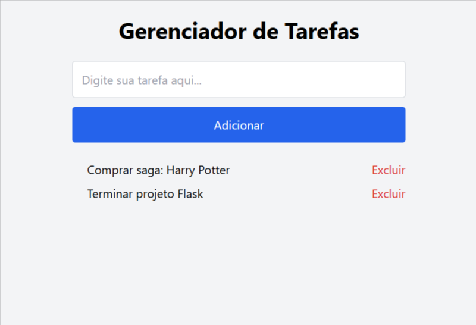

# Gerenciador de Tarefas Simples

Um aplicativo web simples desenvolvido com Flask para gerenciar tarefas básicas: adicionar, listar e excluir. Ideal para quem está começando no Flask e quer entender a criação de rotas, formulários, templates e manipulação de dados em memória.




## Funcionalidades

- Adicionar tarefas via formulário web  
- Listar tarefas em tempo real  
- Excluir tarefas individuais  
- Layout responsivo estilizado com Tailwind CSS via CDN  

## Tecnologias Utilizadas

- Python 3.x  
- Flask  
- Jinja2 (motor de templates do Flask)  
- Tailwind CSS (via CDN)  

## Estrutura do Projeto

```
gerenciador_tarefas/
├── app.py
├── src/
│   ├── requirements.txt
│   └── img/
│       └── app.png
├── templates/
│   └── index.html
└── static/

```

## Como Rodar o Projeto

1. Clone este repositório:  
   ```bash
   git clone <URL_DO_REPOSITORIO>
   cd gerenciador_tarefas

2. Crie e ative um ambiente virtual:
python -m venv venv
    #### Windows
        venv\Scripts\activate

    #### Linux/Mac
        source venv/bin/activate

3. Instale as dependências:

        pip install -r src/requirements.txt


## Possíveis Melhorias Futuras

- Persistência de dados utilizando banco de dados (SQLite, PostgreSQL)

- Autenticação de usuários

- Validação mais robusta de entrada de dados

- Melhorias no design com Tailwind configurado localmente

- Refatoração para estrutura modular com Blueprints

## Licença
    Este projeto está sob a licença MIT.